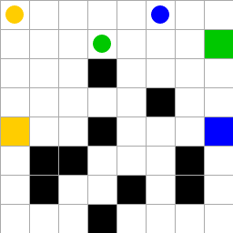

# MAGE: Multi-Agent Grid Environment



## Introduction

MAGE is a grid-based environment with obstacles (walls) and agents. The agents can move in one of the four cardinal directions. If they try to move over an obstacle or out of the grid bounds, they stay in place. Each agent has a unique color and a goal state of the same color. The environment is episodic, i.e. the episode ends when all agents reach their goals.

To initialise the grid, the user must decide where to put the walls on the grid. This can bee done by either passing a map name or a custom map. If a map name is passed, the map is loaded from a set of pre-existing maps. The names of the available pre-existing maps are "4x4" and "8x8". Conversely, If a custom map is passed, the map provided by the user is parsed and loaded. The map must be a list of strings, where each string denotes a row of the grid and is a sequence of 0s and 1s, where 0 denotes a free cell and 1 denotes a wall cell. An example of a 4x4 map is the following:

```python
["0000", 
 "0101", 
 "0001", 
 "1000"]
``` 

The user must also decide the number of agents and their starting and goal positions on the grid. This can be done by passing two lists of tuples, namely `starts_xy` and `goals_xy`, where each tuple is a pair of coordinates (x, y) representing the agent starting/goal position. 

Currently, the user must also define the color of each agent. This can be done by passing a list of strings, where each string is a color name. The available color names are: red, green, blue, purple, yellow, grey and black. This requirement will be removed in the future and the color will be assigned automatically.

The user can also decide whether the agents disappear when they reach their goal. This can be done by passing a boolean value to `disappear_on_goal`. If `disappear_on_goal` is True, the agent disappears when it reaches its goal, otherwise the agent remains on the grid after it reaches its goal. This feature is currently not implemented and will be added in future versions.

Note that, currently no reward mechanism is implemented in the environment but it will be introduced soon.

## Installation

<!---
To install SimpleGrid, you can either use pip

```bash
pip install mage
```

or you can clone the repository and run an editable installation

```bash
git clone https://github.com/damat-le/mage.git
cd mage
pip install -e .
```
--->

Currently, only editable installation is supported:

```bash
git clone https://github.com/damat-le/mage.git
cd mage
pip install -e .
```

## Getting Started

An example illustrating how to use MAGE is available in the `example.py` script.

## Citation

Please use this bibtex if you want to cite this repository in your publications:

```tex
@misc{mage,
  author = {Leo D'Amato},
  title = {Multi-Agent Grid Environment},
  year = {2022},
  publisher = {GitHub},
  journal = {GitHub repository},
  howpublished = {\url{https://github.com/damat-le/mage}},
}
```
## Disclaimer

The project is under development. In the future releases, the following features will be added:

- add reward mechanism for RL tasks
- add gym/PettingZoo integration
- add the random generation of maps
- add the disappear-on-goal feature
- prepare the project to be uploaded on PyPI

<!---
## Getting Started

Basic usage options:

```python
import gym 
import gym_simplegrid

# Load the default 8x8 map
env = gym.make('SimpleGrid-8x8-v0')

# Load the default 4x4 map
env = gym.make('SimpleGrid-4x4-v0')

# Load a random map
env = gym.make('SimpleGrid-v0')

# Load a custom map with multiple starting states
# At the beginning of each episode a new starting state will be sampled
my_desc = [
        "SEEEEEES",
        "EEESEEES",
        "WEEWEEEE",
        "EEEEEWEG",
    ]
env = gym.make('SimpleGrid-v0', desc=my_desc)

# Set custom rewards and introduce noise
# The agent will move in the intended direction with probability 1-p_noise
my_reward_map = {
        b'E': -1.0,
        b'S': -0.0,
        b'W': -5.0,
        b'G': 5.0,
    }
env = gym.make('SimpleGrid-8x8-v0', reward_map=my_reward_map, p_noise=.4)
```

Example with rendering:

```python
import gym 
import gym_simplegrid

env = gym.make('SimpleGrid-8x8-v0')
observation = env.reset()
T = 50
for _ in range(T):
    action = env.action_space.sample()
    env.render()
    observation, reward, done, info = env.step(action)
    if done:
        observation = env.reset()
env.close()
```
--->
